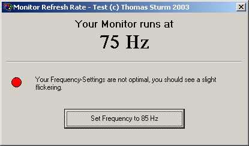



## Change the Monitor Refresh Rate ONLY \!

### Description

I was looking for some code to adjust the Monitor Refresh Rate for some time now, but I just found examples on how to change the Resolution and the Color-Depth, but not the Frequency alone. It took some time and some research, but I managed to do it by myself, and now I want to share it with you guys !
 
### More Info
 

             |
---                |---
**Submitted On**   |2003-06-23 15:44:02
**By**             |[Thomas Sturm](https://github.com/Planet-Source-Code/PSCIndex/blob/master/ByAuthor/thomas-sturm.md)
**Level**          |Advanced
**User Rating**    |5.0 (25 globes from 5 users)
**Compatibility**  |VB 6\.0
**Category**       |[Windows API Call/ Explanation](https://github.com/Planet-Source-Code/PSCIndex/blob/master/ByCategory/windows-api-call-explanation__1-39.md)
**World**          |[Visual Basic](https://github.com/Planet-Source-Code/PSCIndex/blob/master/ByWorld/visual-basic.md)
**Archive File**   |[Change\_the1604966232003\.zip](https://github.com/Planet-Source-Code/thomas-sturm-change-the-monitor-refresh-rate-only__1-46388/archive/master.zip)

### API Declarations

See Code.

